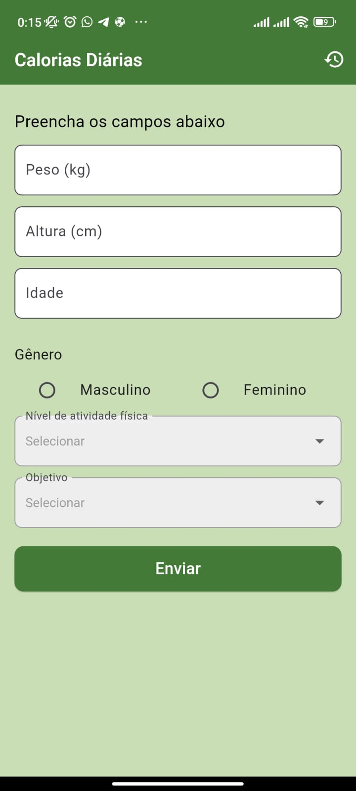
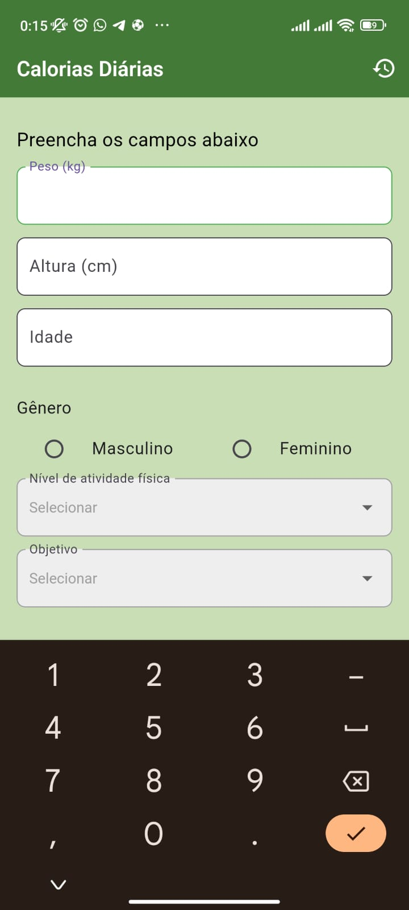
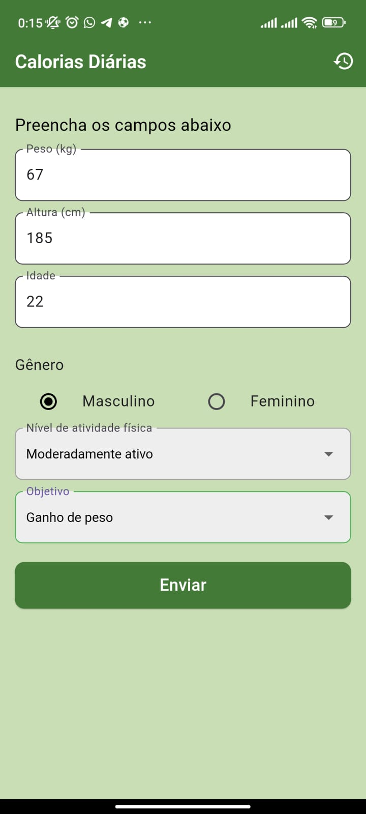
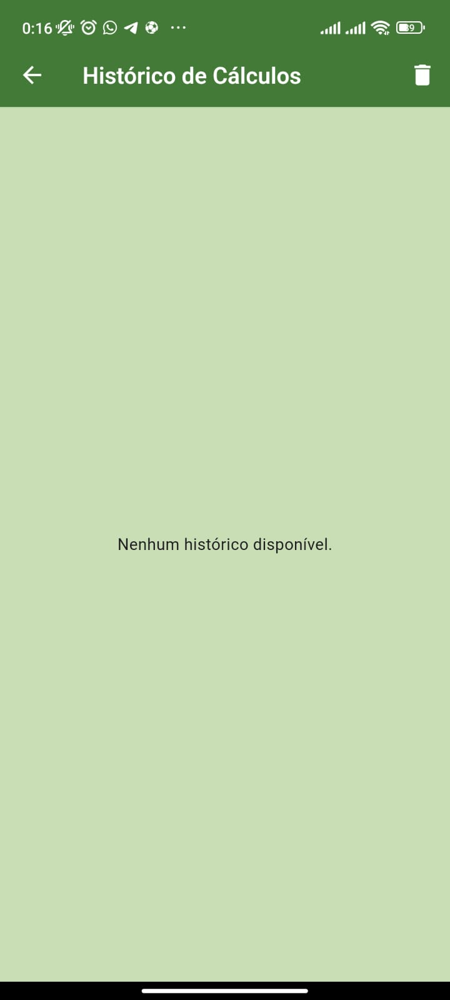
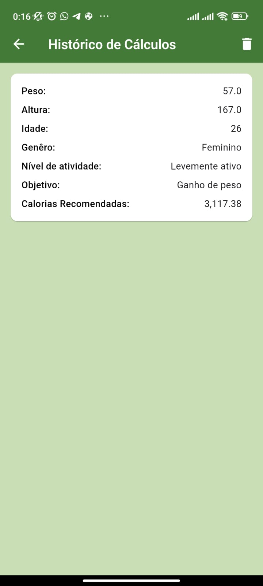
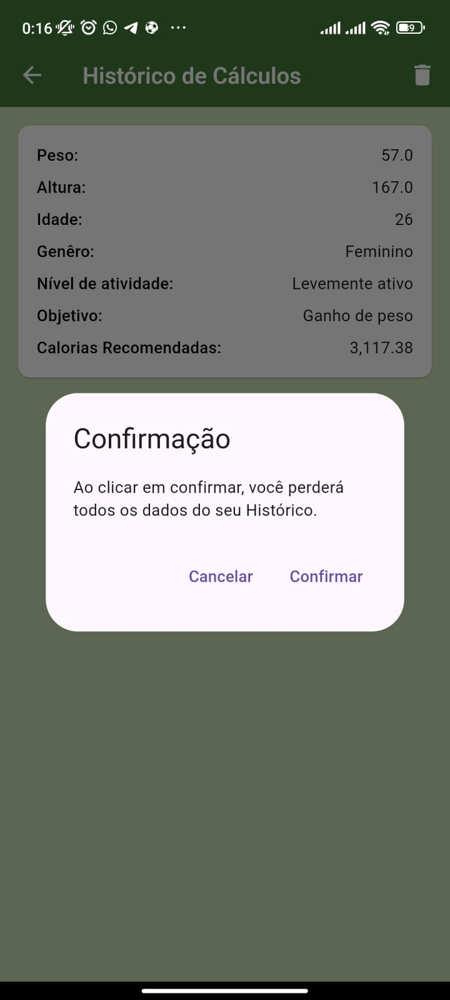

  # Daily Calorie Calculator

## Descrição

O Daily Calorie Calculator é um aplicativo desenvolvido para ajudar os usuários a calcularem a quantidade diária recomendada de calorias com base em suas informações pessoais, como peso, altura, idade, nível de atividade física e objetivo (perda ou ganho de peso). O aplicativo salva essas informações localmente e permite acompanhar o histórico de calorias recomendadas.

## Funcionalidades
  - Cálculo da taxa metabólica basal (TMB)
  - Cálculo de calorias diárias recomendadas com base em níveis de atividade física e metas
  - Armazenamento de dados locais e histórico de calorias recomendadas
  - Interface intuitiva e amigável
## Como Rodar o Projeto
  - Pré-requisitos
  - Flutter SDK instalado
  - Emulador Android ou dispositivo físico conectado
  - Passos para executar o aplicativo
 1 Clone o repositório:
  git clone https://github.com/AdrielCosta420/daily_calorie_calculator.git

2 Acesse o diretório do projeto:
  cd daily_calorie_calculator
3 flutter pub get
4 Conecte um dispositivo ou inicie um emulador e rode o aplicativo:

## Capturas de Tela
Inicio
   
Resultado do Objetivo de ganhar peso
  
Resultado do Objetivo de perder peso

Histórico de dados Armazenados
   
Loader

## Estrutura do Projeto
O projeto segue uma estrutura modular com o uso de MobX para gerenciamento de estado. A lógica de cálculo e armazenamento de dados está separada em stores.

├── lib
      App                 # Pasta principal contendo todas as outras pastas
       core               # Funções e dados centrais
       domain             # Modelos de dados
       presentation       # Interface gráfica e widgets
       stores             # Lógica de negócios com MobX
├── assets                # Imagens e capturas de tela para documentação
└── pubspec.yaml          # Configurações do projeto e dependências

## Download do APK
Baixe o arquivo APK para testar o aplicativo em seu dispositivo Android:
Download APK [Clique aqui](https://github.com/AdrielCosta420/daily_calorie_calculator/releases/download/flutter/app-release.apk)

Contribuições
Contribuições são bem-vindas! Se você deseja sugerir melhorias ou correções, fique à vontade para abrir uma issue ou enviar um pull request.

